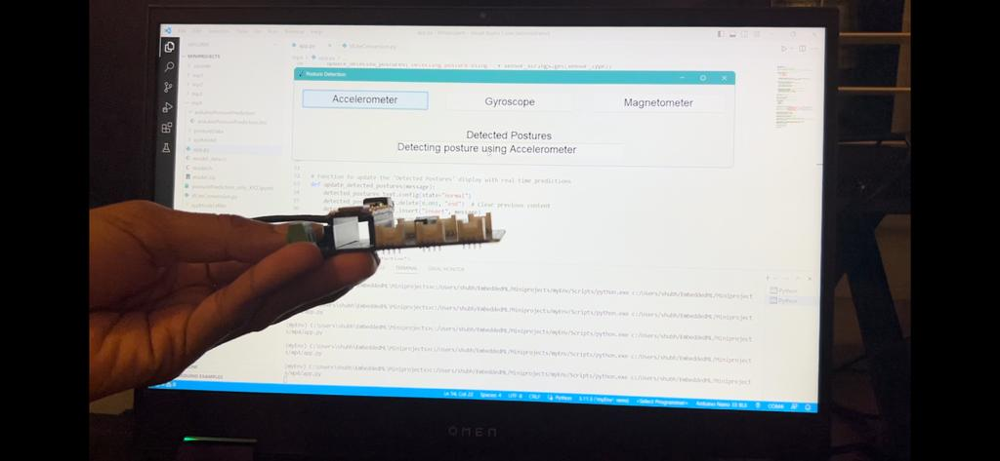
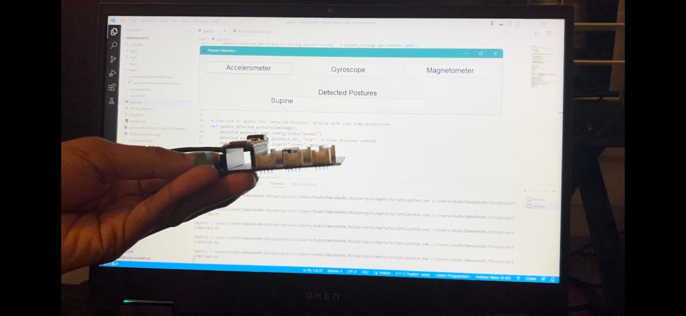
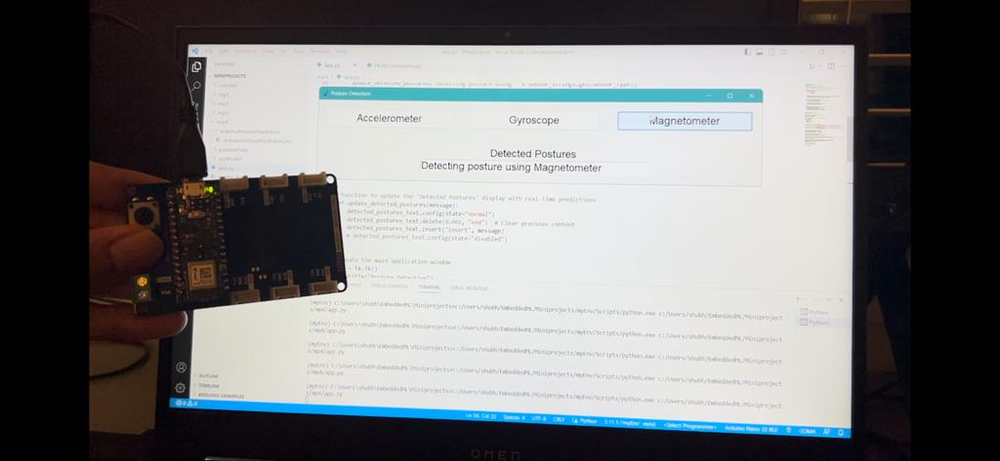
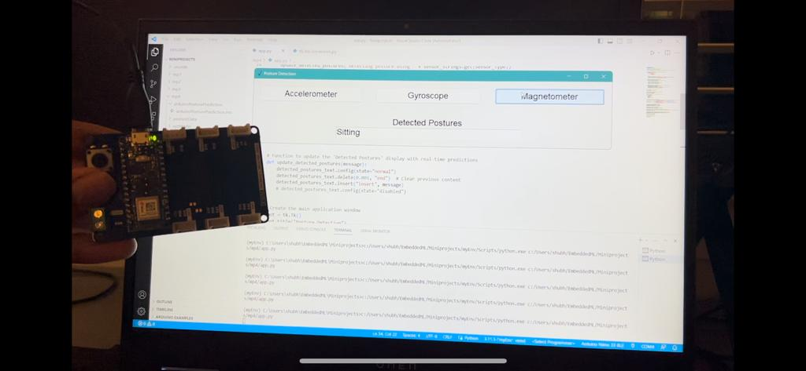

# Posture Detection using Arduino BLE 33
This project detects body postures like supine, prone, side, and sitting on the Arduino using tensorflow-lite. 

## Installation and Changes in Code to use it

You'll have to install the Python Tkinter and pyserial libraries on your laptop to run the GUI and will need to install Harvard Arduino Tensorflow libraries to compile the Arduino code. 

Also, change the model path in the Arduino file and specify correct COM port in the app.py file to connect the interface and Arduino.

## Demonstration Images
Selected Accelerometer Sensor

Posture predicted using accelerometer

Selected Magnetometer Sensor

Posture predicted using magnetometer
